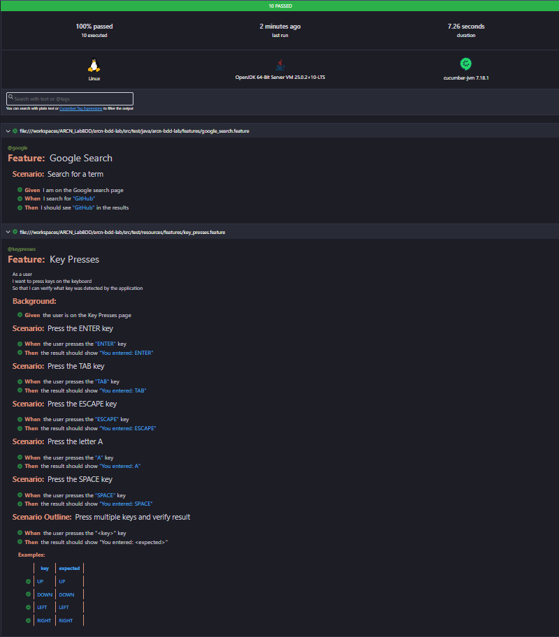
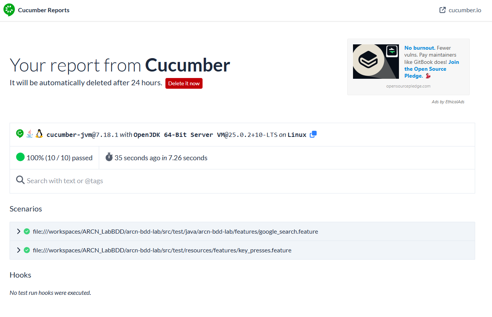

# bdd-selenium-java-lab

Proyecto de automatizacion BDD con Selenium WebDriver, ChromeDriver, Cucumber y Java.
Configurado para ejecutarse con Maven en entornos como GitHub Codespaces.

---

## Nueva feature: Key Presses

La feature **Key Presses** fue implementada tomando como referencia la pagina:
[The Internet - Key Presses](https://the-internet.herokuapp.com/key_presses)

Esta pagina permite presionar teclas en un campo de texto y muestra el resultado en pantalla con el formato:

- `You entered: [KEY]`

### Patron usado: PageFactory

La implementacion sigue el patron **PageFactory** de Selenium, declarando elementos con `@FindBy` e inicializandolos con `PageFactory.initElements()`.

- `KeyPressesPage.java` -> Page Object con elementos y acciones de la pagina.
- `KeyPressesSteps.java` -> Step definitions que conectan Gherkin con el Page Object.
- `key_presses.feature` -> Escenarios en Gherkin (ingles).

### Escenarios implementados

**Escenario 1: Press the ENTER key**

```gherkin
Scenario: Press the ENTER key
	When the user presses the "ENTER" key
	Then the result should show "You entered: ENTER"
```

**Escenario 2: Press the TAB key**

```gherkin
Scenario: Press the TAB key
	When the user presses the "TAB" key
	Then the result should show "You entered: TAB"
```

**Escenario 3: Press the ESCAPE key**

```gherkin
Scenario: Press the ESCAPE key
	When the user presses the "ESCAPE" key
	Then the result should show "You entered: ESCAPE"
```

**Escenario 4: Press the letter A**

```gherkin
Scenario: Press the letter A
	When the user presses the "A" key
	Then the result should show "You entered: A"
```

**Escenario 5: Press the SPACE key**

```gherkin
Scenario: Press the SPACE key
	When the user presses the "SPACE" key
	Then the result should show "You entered: SPACE"
```

**Scenario Outline: Press multiple keys and verify result**

```gherkin
Scenario Outline: Press multiple keys and verify result
	When the user presses the "<key>" key
	Then the result should show "You entered: <expected>"

	Examples:
		| key   | expected |
		| UP    | UP       |
		| DOWN  | DOWN     |
		| LEFT  | LEFT     |
		| RIGHT | RIGHT    |
```

### Nota tecnica

Los tests corren en modo **headless**. Para el caso de `ENTER`, se evita el submit del formulario en la pagina para mantener estable el resultado en pantalla durante la validacion automatizada.

---

## Ejecutar pruebas

```bash
cd arcn-bdd-lab
mvn test
```

ALERTA: Debes ejecutar este comando antes de tomar capturas o validar reportes.

## Reportes generados

Despues de ejecutar `mvn test`, se generan reportes en:

- `arcn-bdd-lab/target/HtmlReports/report.html`



## Resultados (evidencia)


**Link:** https://reports.cucumber.io/reports/52cb4ca0-403d-4093-b1c9-b70dbbffdcec

