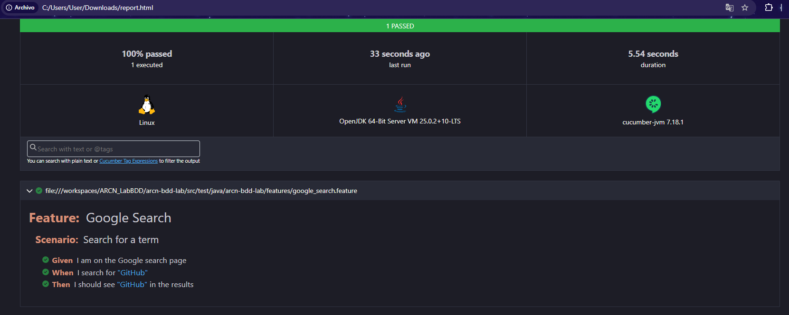

# ARCN_LabBDD

## Ejecutar escenarios BDD

Para ejecutar todos los escenarios configurados en Cucumber:

```bash
cd arcn-bdd-lab
mvn test
```

## Validar reporte HTML

Despues de ejecutar `mvn test`, se genera el reporte HTML en:

`arcn-bdd-lab/target/HtmlReports/report.html`

Para validarlo, descarga ese archivo (`target/HtmlReports/report.html`) y abrelo en tu navegador.

Tendrás una vista como esta:

